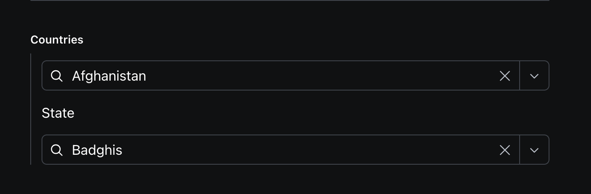
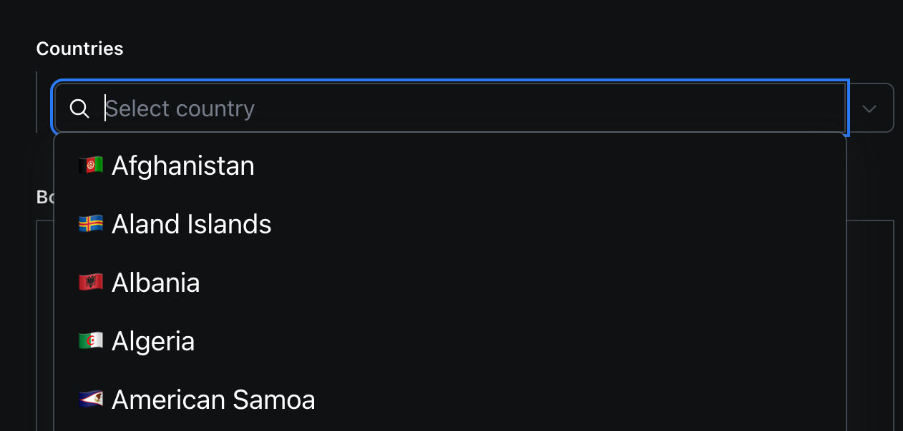
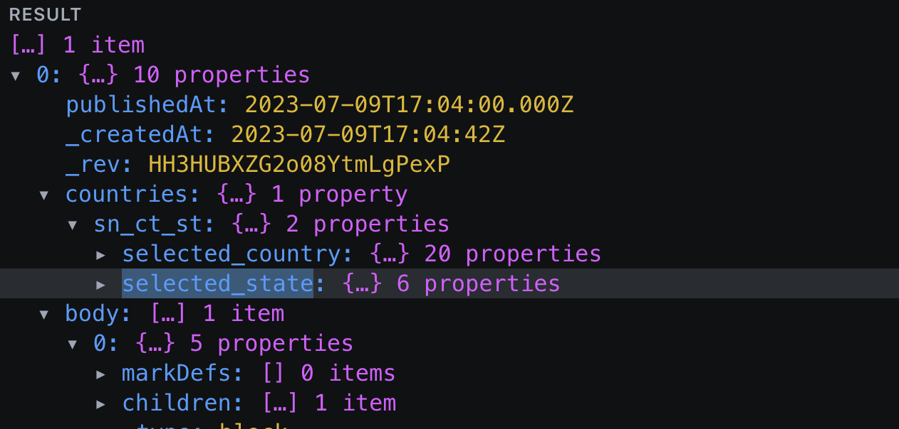

# sanity-plugin-country-state-select

> This is a **Sanity Studio v3** plugin.

## What is it?

A sanity plugin to generate custom field for countries and states in the ISO 3166 standard for [Sanity](https://sanity.io/).







## Installation

```sh
npm i sanity-plugin-country-state-select
```

## Usage

Add it as a plugin in `sanity.config.ts` (or .js):

```js
import {countryStateListPlugin} from 'sanity-plugin-country-state-select'

export default defineConfig({
  // ...
  plugins: [countryStateListPlugin()],
})
```

Now you can use the `countrieslist` type in your schema types:

```js
import {defineType, defineField} from 'sanity'

defineType({
  // [...]
  fields: [
    defineField(
      {
        type: 'code',
        name: 'myCodeField',
        title: 'My code field',
      },
      {
        title: 'Countries',
        name: 'countries',
        type: 'countrieslist', // required
        options: {
          showStates: true,
          placeholder: 'Select country',
          showIcon: true,
        },
      },
    ),
  ],
})
```

## Options

- `showStates` - Boolean; to render states dropdown
- `placeholder` - string; Placeholder for country list dropdown
- `showIcon` - Boolean; show search icon with dropdown

## License

MIT-licensed. See LICENSE.

## Develop & test

This plugin uses [@sanity/plugin-kit](https://github.com/sanity-io/plugin-kit)
with default configuration for build & watch scripts.

See [Testing a plugin in Sanity Studio](https://github.com/sanity-io/plugin-kit#testing-a-plugin-in-sanity-studio)
on how to run this plugin with hot reload in the studio.

### UI Workshop

Run
`workshop dev`

To test the CodeMirror lazy component.
